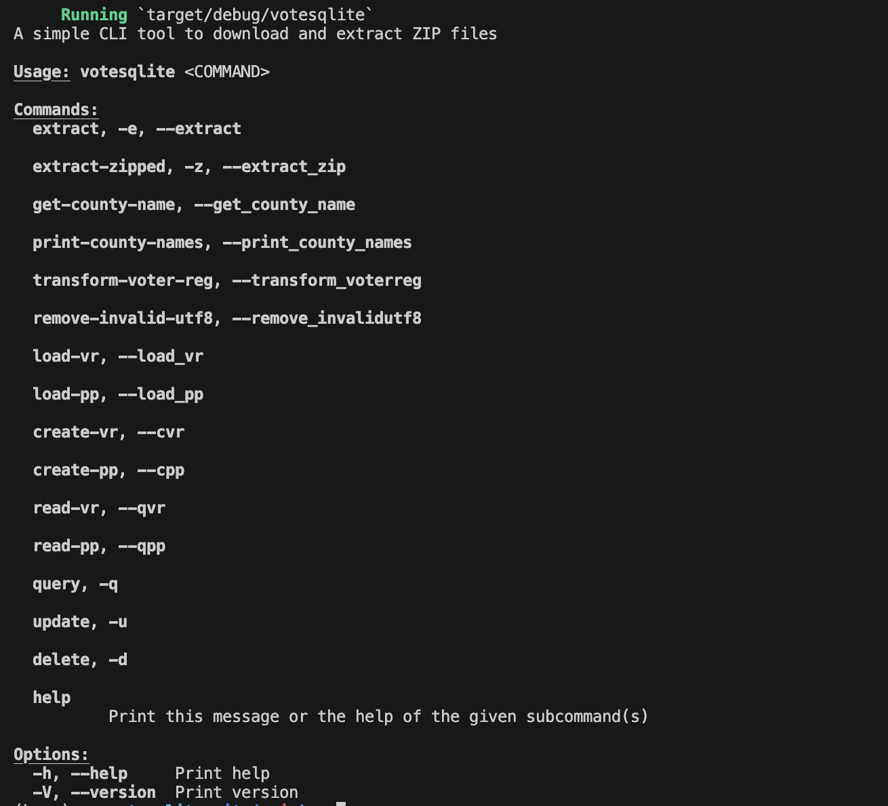

# This is a repository for Mini Project 7

## Status Badge

If you review the Summary of past jobs in the GitHub "Actions" panel, you can view that this repository is able to successfully format, lint, and build the included Rust logic. 

## Binary Download (Artifact Link)
https://github.com/nogibjj/PeterdeGuzman_RustCLITool/actions/runs/11490925099/artifacts/2096674209

### Project Motivation & Purpose
This project uses Rust to create a binary file Command-Line Tool. This repository builds upon my previous work analyzing North Carolina individual-level voter registration and vote history data. If interested, please check out this repository https://github.com/nogibjj/PeterdeGuzman_Mini6 to view a previous project where I created an ETL-Query (Extract, Transform, Load, Query) pipeline using Python and Databricks to join and query individual-level voter registration and vote history data for North Carolina.

### Tool Explanation 
This tool allows users to download data from links to zipped files into their chosen directory (using the `extract_zip()` function). Building off my previous work with North Carolina voter data, this tool also allows users to identify the county name from a file name that includes a two-digit North Carolina county id. Finally, this tool expands the use of this `get_county_name()` function to print the county names for all files in a directory (using the `print_county_names()` function).

### CLI Tool Documentation

### Proof of Successful Command-Line Operations (Video)

### Data 
This project uses data on voter registration for individuals in North Carolina. More information and a link to the data is available at:

-   https://www.ncsbe.gov/results-data/voter-registration-data

