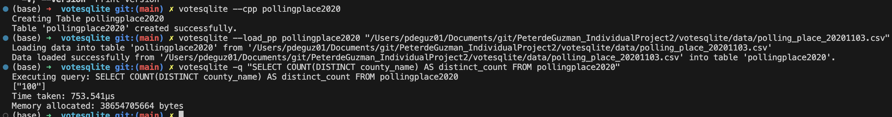

# This is a repository for Mini Project 8 and Individual Project 2

## Status Badge

If you review the Summary of past jobs in the GitHub "Actions" panel, you can view that this repository is able to successfully format, lint, build, and test the included Rust logic. 

## Binary Download (Artifact Link)

-   This tool can be used by downloading the binary file from the above link. Alternatively, users can fork this repo and use `cargo build --release` and `cargo run` to run this CLI tool locally. 

## Mini Project 8 - Explanation
This project satisfies the requirements for Mini Project 8. I rewrote my existing Python script for loading and manipulating polling place data, and executing queries in a SQLite database. I used modules and crates in Python and Rust to measure the speed and memory usage of the SQL queries. 

Python Query:

Rust Query:

## Individual Project 2 - Explanation
This project also satisfies the requirements for Individual Project 2. 

### Use of LLM
As a new user of Rust, when I started this project I used ChatGPT-4 to review my existing Python functions and suggest crates and functions to translate the functions into Rust's syntax. I have found that the LLM will often hallucinate and suggest crates or functions that do not exist, or it will suggest needlessly complex approaches to parsing files. 

### SQLite Database
The Rust and Python scripts are both set up to load data into a "pollingplace2020.db" SQLite database and execute CRUD (Create, Read, Update, Delete) operations and a generalized query function. 

### Project Motivation & Purpose
This project uses Rust and Python to create a binary file Command-Line Tool to intake North Carolina polling place data and load it into a Sqlite database through an ETL-Query (Extract, Transform, Load, Query) pipeline. This repository builds upon my previous work analyzing North Carolina individual-level voter registration and vote history data. If interested, please check out this repository https://github.com/nogibjj/PeterdeGuzman_Mini6 to view a previous project where I created an ETL pipeline using Python and Databricks to join and query individual-level voter registration and vote history data for North Carolina.

### Tool Explanation 
This tool allows users to download data from links to zipped files into their chosen directory (using the `extract_zip()` function). Building off my previous work with North Carolina voter data, this tool also allows users to identify the county name from a file name that includes a two-digit North Carolina county id. Finally, this tool expands the use of this `get_county_name()` function to print the county names for all files in a directory (using the `print_county_names()` function).

### CLI Tool Documentation
![alt text]

### Proof of Successful Command-Line Operations (Video)

### Data 
This project uses data on polling places for elections in North Carolina. More information and a link to the data is available at:

-   https://www.ncsbe.gov/results-data/voter-registration-data

### Future Improvements
This repository is a work in progress. In the future, I will finish building out the functionality to intake NC voter registration and vote history data through an ETL pipeline into an external SQL database. At present, this project uses a SQLite database and I am navigating encoding issues with the voter registration data. 
